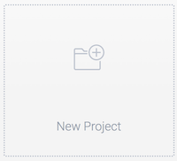
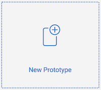
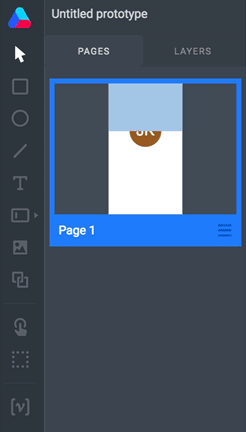
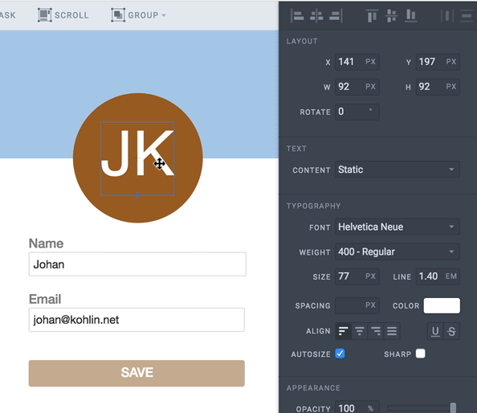
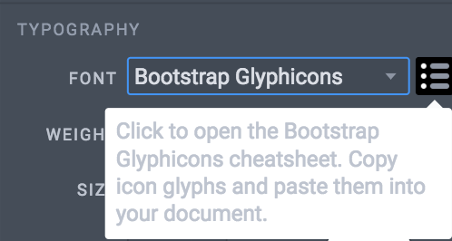
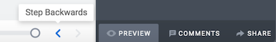

# Prototyping with Atomic 

1. Create an account and login at [atomic.io](atomic.io) 
2. Start a new project and name it

3. Create a new Prototype

##Getting around in the interface

###Page properties
Set the dimensions of your page in the properties panel or select a preset mobile, tablet or desktop size from the dropdown menu. Just make sure nothing on your canvas is selected to see these options. 

### Drawing

Create and style shapes, lines, images and type. Selecting an element on the canvas will show you the properties for that element in the right hand panel. 

Importing images is as simple as drag and drop

###Pages/Layers panel
The elements on the page are added to individual layers. Layers can be locked, hidden and rearranged.  Switch to the Page panel to get an overview of your pages.

###Properties panel
The property panel on the right side shows different settings based on your current selection. 

To add icons, select the text tool, choose an icon font, then click on the options menu button to open a webpage from where you can copy the unicode entity to paste in your text box.

###Preview
At the bottom of the interface you find the undo timeline and a button to switch viewing mode between editing and previewing. 

## Interaction and animation

### Page transitions

In most cases you need a page for each view. You can navigate to those pages by adding hotspots that can be clicked during Preview. When adding the action Go To Page, you can add a page transition as well.

### Automatic tweening

If the same shape is on two pages. The property changes will be animated automatically.

